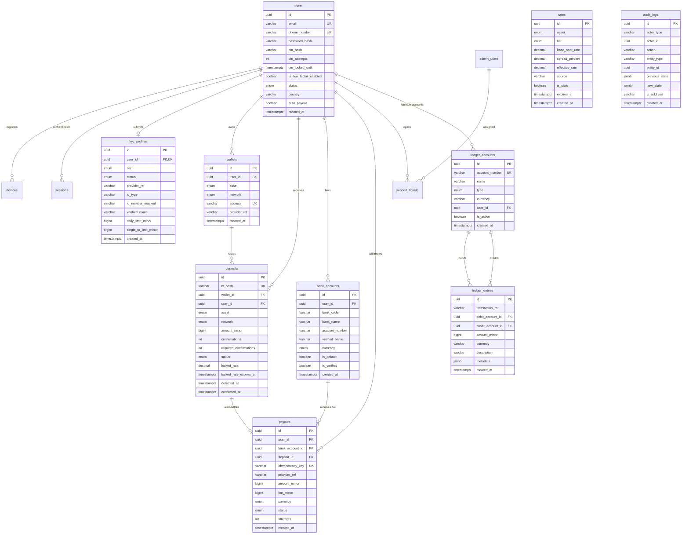

# Database Schema & Double-Entry Ledger Architecture

This document describes the PostgreSQL data model and double-entry accounting engine for the Off-Ramp Platform.

---

## 1. Entity-Relationship (ER) Diagram

---

## 2. Double-Entry Accounting Architecture

### Principles
1. **Never a Single "Balance" Field**: Balances are calculated by summing balanced journal entries:
   $$\text{Balance} = \sum \text{Debits} - \sum \text{Credits} \quad (\text{or vice versa depending on account type})$$
2. **Integer Minor Units**:
   - `NGN` (Kobo): ₦100.00 = `10000`
   - `GHS` (Pesewas): GH₵100.00 = `10000`
   - `USDT / USDC` (Micro-units): 100.000000 USDT = `100000000`
   - `BTC` (Satoshis): 1.00000000 BTC = `100000000`
3. **Account Classification**:
   - **ASSET**: Platform-owned resources (e.g. `1010-VAULT-USDT`, `1030-BANK-FLOAT-NGN`). Increases on DEBIT, decreases on CREDIT.
   - **LIABILITY**: Obligations owed to customers (e.g. `2010-LIABILITY-USER-NGN`). Increases on CREDIT, decreases on DEBIT.
   - **REVENUE**: Earnings from spread and fees (e.g. `4010-REVENUE-FX-SPREAD`). Increases on CREDIT.
   - **EXPENSE**: Costs incurred (e.g. `5010-EXPENSE-PAYOUT-FEES`). Increases on DEBIT.

### Concrete Journal Posting Examples

#### Scenario A: Deposit Confirmed (100 USDT received at locked rate ₦1,500/USDT)
*Effective NGN Payout: ₦150,000 (after 1.5% spread)*
1. **Crypto Ledger Entry** (USDT):
   - **Debit**: `1010-VAULT-USDT` (`100,000,000` micro-units) -> Platform Asset increases
   - **Credit**: `2001-PENDING-SETTLEMENT-USDT` (`100,000,000` micro-units)
2. **Fiat Ledger Entry** (NGN):
   - **Debit**: `2001-PENDING-SETTLEMENT-NGN` (`15,225,000` kobo = Base value ₦152,250)
   - **Credit**: `2010-LIABILITY-USER-NGN` (`15,000,000` kobo = Net payout ₦150,000)
   - **Credit**: `4010-REVENUE-FX-SPREAD` (`225,000` kobo = ₦2,250 platform spread profit)

#### Scenario B: Automated Bank Payout Executed
1. **Hold & Execution**:
   - **Debit**: `2010-LIABILITY-USER-NGN` (`15,000,000` kobo) -> User liability cleared
   - **Credit**: `1030-BANK-FLOAT-NGN` (`15,000,000` kobo) -> Bank float reduced
2. **Transfer Fee Expense (if applicable)**:
   - **Debit**: `5010-EXPENSE-PAYOUT-FEES` (`10,750` kobo = ₦107.50 rail fee)
   - **Credit**: `1030-BANK-FLOAT-NGN` (`10,750` kobo)

---

## 3. Idempotency & Safety Guarantees

- **Deposits**: `tx_hash` is unique at the database level. Webhook replays or duplicate block scans are ignored or return existing records.
- **Payouts**: Client generates a deterministic `idempotency_key` (e.g. `payout-user_id-deposit_id-timestamp`). The database enforces uniqueness so duplicate transfer orders can never be posted.
- **Ledger Entries**: Each ledger posting references a unique `transaction_ref`. Balanced entries are executed inside atomic `SERIALIZABLE` or `READ COMMITTED` transactions with row-level locks.
